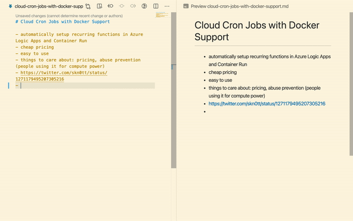

# markdown-tweet-expander

Easily embed tweets into your notes. It's using [publish.twitter.com](https://publish.twitter.com) under the hood.

> Another <a href="https://twitter.com/code?ref_src=twsrc%5Etfw">@code</a> extension in the making, this time for people who like to embed tweets in their notes ^^
> 
>  
> &mdash; Simon Knott (@skn0tt) <a href="https://twitter.com/skn0tt/status/1284019905986273281">July 17, 2020</a>

## Getting Started

1. Install the extension
2. Highlight a Tweet URL
3. `CMD+ALT+P`; "Expand Tweet"
4. Profit

## How it works

Under the hood, it uses publish.twitter.com to generate the tweet markup.

## TODO

- [ ] Create a Logo ([Help Wanted](mailto:info@simonknott.de?subject=I%20wanna%20help%20you%20with%20markdown-tweet-expander!&body=Hi%20Simon%2C%0A%0A...%0A))
